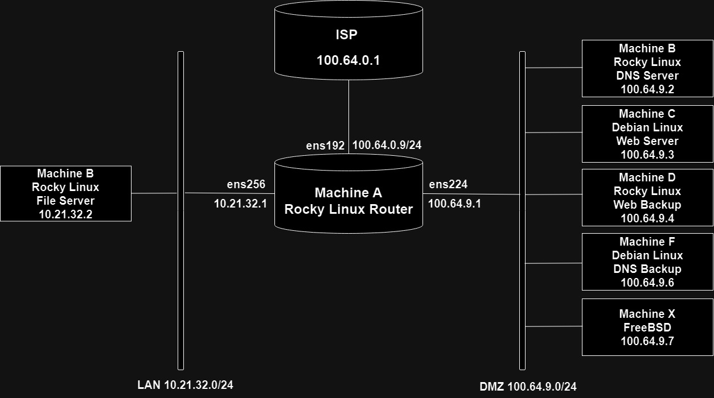
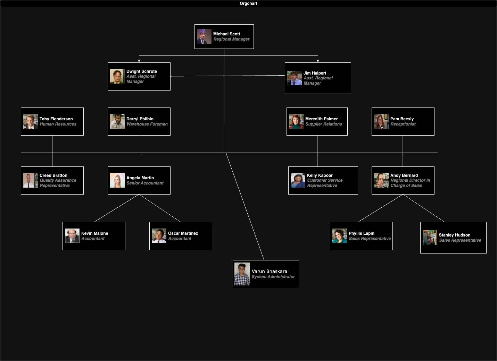

# The Dunder Mifflin Company
### The Dunder Mifflin Network

This is a scenario of a company named Dunder Mifflin. This is the fictional paper company from the TV show 'The Office'. I am using the names of the characters from the show as my users, and I am the System Administrator and a network of virtual machines to represent the hypothetical computer network of the company.

The figure above shows the Dunder-Mifflin network. The network consists of six production machines that are initially named Machine A through Machine F. The network consists of a connection to the ISP (WAN), a Demilitarized Zone (DMZ) network and an internal network (LAN). I configured the machines to perform specific tasks such as being a web server, DNS server and a file server. 

**Machine A 100.64.0.26 (Rocky 9.2)**  
This is the gateway machine and acts as a router to connect the various networks (WAN, LAN and DMZ). This is also a DHCP Server. You can find how I configured this as a DHCP server [here](https://isneha.net/linux/dhcp).  
  
**Machine E 10.21.32.2 (Rocky 9.2)**  
This is the file server machine on the internal network. You can find how I configured the file server [here](https://isneha.net/linux/lvm). The machine is not directly accessible to the outside world and can only be reached by pivoting through Machine A. It contains the home directories of all the users that can be accessed by other machines on the LAN which we don't show explicitly.  
  
**Machine B 100.64.9.2 (Rocky 9.2)**  
This is a DNS Server..  
  
**Machine C 100.64.9.3 (Debian 12.1)**  
This is a Web Server.  
  
**Machine D 100.64.9.4 (Rocky 9.2)**  
This is a Backup Web Server.  
  
**Machine F 100.64.9.2 (Debian 12.1)**  
This is a Backup DNS Server. 

Machines B,C,D,F are on the DMZ network (100.64.26.0/24). They are accessible from the internet through Machine A.  

All the machines run an ssh server.

### The Dunder Mifflin Organization Chart

| Username     | Name             | Title                                  |
|--------------|------------------|-----------------------------------------|
| mscott       | Michael Scott    | Regional Manager                       |
| jhalpert     | Jim Halpert      | Assistant Regional Manager             |
| dschrute     | Dwight Schrute   | Assistant to the Regional Manager      |
| pbeesly      | Pam Beesly       | Receptionist                           |
| abernard     | Andy Bernard     | Regional Director in Charge of Sales   |
| plapin       | Phyllis Lapin    | Sales Representative                   |
| shudson      | Stanley Hudson   | Sales Representative                   |
| amartin      | Angela Martin    | Senior Accountant                      |
| omartinez    | Oscar Martinez   | Accountant                             |
| kmalone      | Kevin Malone     | Accountant                             |
| dphilbin     | Darryl Philbin   | Warehouse Foreman                      |
| kkapoor      | Kelly Kapoor     | Customer Service Representative        |
| tflenderson  | Toby Flenderson  | Human Resources                        |
| mpalmer      | Meredith Palmer  | Supplier Relations                     |
| cbratton     | Creed Bratton    | Quality Assurance Representative       |
| vabh4134     | Varun Bhaskara   | System Administrator                   |